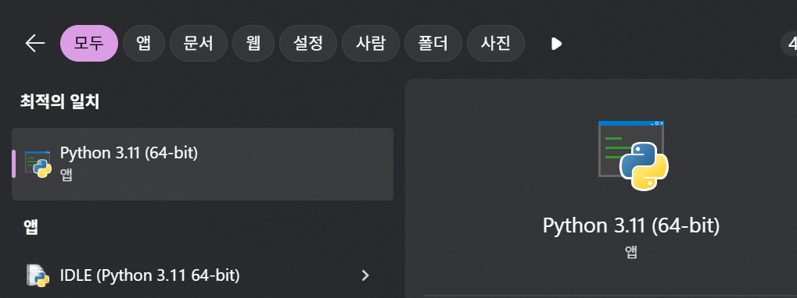
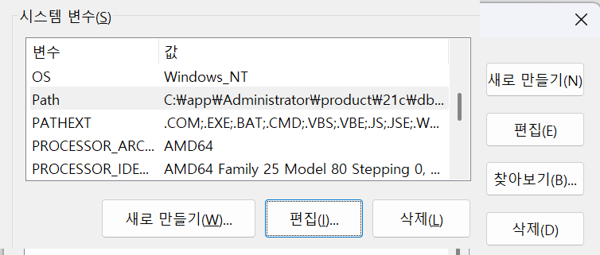

# 반달곰 커피 홈페이지 개발 준비

상우는 반달곰 커피를 홍보하기 위해 가장 먼저 홈페이지를 제작해야 했다. 간단한 홍보 페이지 디자인은 완료했지만, 웹사이트를 만들고 필요한 기능들을 구현하기 위해 개발 도구 설치와 환경 세팅부터 시작해야 했다.

빠르고 가볍게 개발 및 운영할 수 있도록 Python을 선택하고, 필요한 도구들을 하나씩 설치하며 환경을 구성하였다.

---

## ✅ 수행 과제

1. **Windows 터미널 설치**
   - Windows 사용자는 [Windows Terminal](https://apps.microsoft.com/store/detail/windows-terminal/9N0DX20HK701) 설치
<table>
  <tr>
    <td align="center">
      <br>
      설치 화면
    </td>
    <td align="center">
      <br>
      설치 완료
    </td>
    <td align="center">
      <br>
      실행 화면
    </td>
  </tr>
</table>


2. **Python 설치**
   - Python 3.8 이상 버전 설치
   - 자세한 설치 방법:
      1. **파이썬 공식 웹사이트 방문**
   - [Python.org](https://www.python.org/) 에 접속하여 최신 버전의 파이썬 설치 파일을 다운로드합니다.

      2. **설치 파일 실행**
         - 다운로드한 설치 파일을 실행합니다.
      <br>
         파이썬3.11 설치 화면

3. **환경 변수 설정**
   - Python과 Python 패키지 관리자(`pip`)를 환경 변수에 등록
   - Python과 pip를 환경 변수에 등록하는 방법은 다음과 같습니다. 먼저 Python 설치 경로와 Scripts 폴더 경로를 확인하고, 이를 시스템 환경 변수의 Path 변수에 추가해야 합니다. 이렇게 하면 명령 프롬프트나 터미널에서 Python과 pip 명령어를 어디서든 실행할 수 있습니다. 
      1. Python 설치 경로 확인:
         Python을 설치할 때 기본 설치 경로를 사용했다면 일반적으로 C:\Python<버전> 또는 C:\Users\<사용자 이름>\AppData\Local\Programs\Python\Python<버전>과 같은 경로에 설치됩니다.
         설치 경로를 잘 모를 경우, Python을 다시 설치하면서 설치 경로를 확인하거나, 설치된 Python 파일을 찾아 경로를 확인할 수 있습니다. 
      2. Scripts 폴더 경로 확인: 
         Python 설치 경로 내에 Scripts 폴더가 존재합니다. 이 폴더에는 pip와 같은 Python 패키지 관리 도구들이 위치합니다.
         예를 들어, Python 설치 경로가 C:\Python310 이라면 Scripts 폴더 경로는 C:\Python310\Scripts 입니다. 
   <table>
  <tr>
    <td align="center">
      <br>
      환경변수편집
    </td>
    <td align="center">
      <br>
      환경변수설정
    </td>
  </tr>
</table>

4. **Flask 설치**
   - 터미널에서 다음 명령어 입력:
     ```bash
     pip install flask
     ```
5. **Hello 출력 확인**
   - 터미널에서 Python 실행 후 다음 코드 입력:
     ```python
     print("Hello")
     ```
6. **함수 작성**
   - `Hello` 문자열을 반환하는 함수 작성
   - 함수 이름은 반드시 `hello`로 작성
   - 파일 이름은 반드시 `my_solution.py`로 저장
   - 예시:
     ```python
     def hello():
         return "Hello"
     ```
     [my_solution.py제출링크](https://github.com/nttkor/Codyssey/blob/main/%EA%B3%BC%EC%A0%9501_%EC%84%B8%EA%B3%84%EC%A0%81%EC%9D%B8%EB%B8%8C%EB%9E%9C%EB%93%9C%EB%B0%98%EB%8B%AC%EA%B3%B0%EC%BB%A4%ED%94%BC/%EB%AC%B8%EC%A0%9C_1_%EB%B0%98%EB%8B%AC%EA%B3%B0%EC%BB%A4%ED%94%BC%EC%9D%98%EC%8B%9C%EC%9E%91/my_solution.py)

7. **Visual Studio Code 설치**
   - [VS Code 공식 사이트](https://code.visualstudio.com/)에서 최신 버전 설치
8. **Material Icon Theme 확장 설치**
   - VS Code > Extensions (확장) 탭에서 `Material Icon Theme` 검색 및 설치

---

## ⚙ 개발 환경

- 명령어 입력: 터미널 사용  
  (Windows는 Windows Terminal 사용)
- Python: 3.8 이상
- Visual Studio Code: 최신 버전

---

## ⚠ 제약사항

- 반드시 터미널을 통해 명령 입력  
  (Windows는 Windows Terminal 사용)
- Python 3.8 이상 설치
- Visual Studio Code 최신 버전 사용

---

## 🎁 보너스 과제

- Python의 대표 웹 프레임워크 3가지와 각 특성을 Markdown 파일(`python_webframework.md`)로 정리하여 제출한다.

